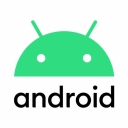
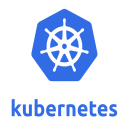
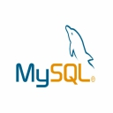
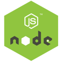
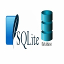

     portfolio

[Daniel Assani](#)

*   [Projets](#)
*   [Skills](#)
*   [Contact](#)

Daniel Assani

Developpeur Web Full stack, ingénieur Logiciel et specialiste dans plusieurs domaine informatique. je construit des solutions informatique innovant pour les entreprises ainsi que les particuliers

Contactez-moi

devasddaniel@gmail.com

Langages de Programmation

Html et CSS

95%

PHP

90%

Javascript

88%

Python

75%

C et C++

73%

C#

65%

Java

68%

Kotlin

60%

Typescript

70%

Technologie

React Js

React Js est un librairie Javascript front-end

Adonis Js

Adonis Js est un framework Javascript back-end pour crée des applications web

Android

la technologie Android avec Android studio permet de crée des application mobile fonctionnant sur les appareils mobile android

Cordova

Cordova est un framework pour la création d'application mobile multi-platerforme fonctionnant sur android, ios, windows ansi qu'un grand nombre de système

Django

Django est un Framework web permettant de crée des applications web avec le langage python

Docker

Docker est une technologie de conteneurisation permettant de sauvegarder les dépendances logiciels des applications au moment de developpement et facilite la mis en production

Flask

Flask est un micro-framework web permettant de crée des applications web en python beaucoup plus rapidement

Git

Git est une Technologie de gestion de version des codes sources

Laravel

Laravel est un framework web permettant de crée des applications web avec le langage Php

Kubernete

Kubernete est une technologie cloud permettant d'automatiser le processus de mis en production des applications web en gerant le load balancing

Mysql

Mysql est un système de gestion de base de donnée efficace qui équipe les serveurs apache et nginx

NodeJs

NodeJs est une technologie javascript facilitant l'usage du javascript coté back-end

Oracle

Oracle est un SGBD puissant permettant de gérer ses base de donnée avec un langage procédurale appelé PLSQL

Postgresql

Postgresql est un système de gestion de base de donnée éfficace concurrent direct de Mysql

SQLite

SQLIte est un SGBD lègere et portable permettant de gérer sa base de donnée de manière plus simple

Bootstrap

SQLIte est un SGBD lègere et portable permettant de gérer sa base de donnée de manière plus simple

TailwindCss

SQLIte est un SGBD lègere et portable permettant de gérer sa base de donnée de manière plus simple

Modelisation 3D

UI/UX DESIGN

Multimedia et design

Compétences et maitrise dans le domaine multimedia depuis plusieurs année